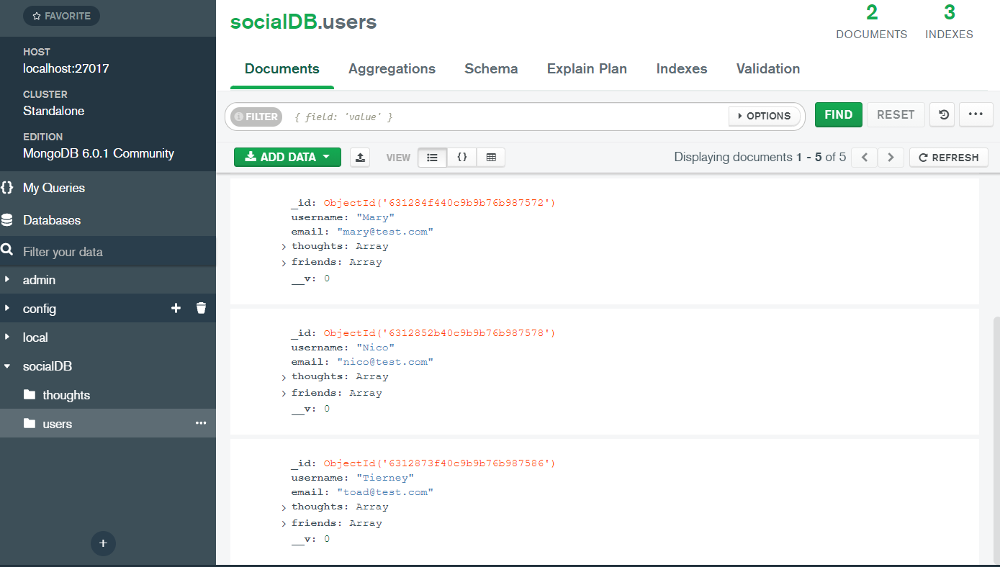
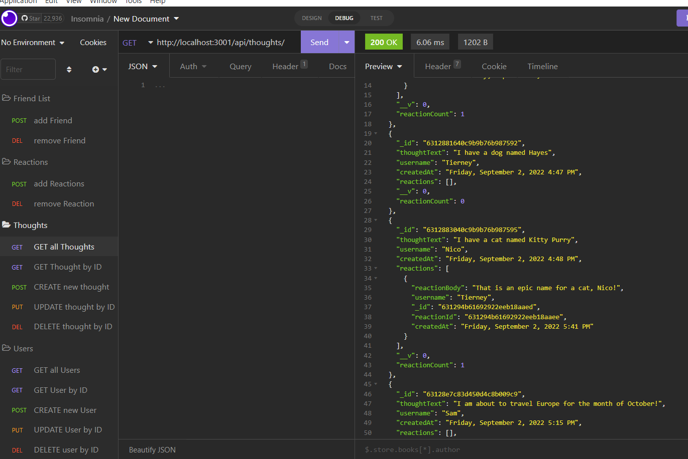

# Social Network API
  

## Description

The application acts as a back end for a hypothetical social network where users can share their thoughts, react to friends’ thoughts, and create a friend list. The app uses Express.js for routing, a MongoDB database, the Mongoose ODM and momentjs to format the timestamp variables. I used Insomnia for testing and validating results of the social media API. This app was written completely in JavaScript and powered by Node.js, Express.js and Mongoose.

## Table of Contents

  - [Description](#description)
  - [Installation](#installation)
  - [Usage](#usage)
  - [License](#license)
  - [How to Contribute](#how-to-contribute)
  - [Tests](#tests)
  - [Questions](#questions)
  - [Mockup Images](#mockups)
  - [Walkthrough Demonstration Videos](#walkthrough-demonstration-videos)

## Installation

To install this application, you will need to clone the repo and run a few commands into the terminal. 

**Installs include**:

* ``npm init`` followed by ``npm install`` (These commands will install the dependencies needed for the package.json)

* ``npm install express`` (The webserver framework for Node.js)

* ``npm install mongoose`` (Mongoose provides a straight-forward, schema-based solution to model your application data. It includes built-in type casting, validation, query building, business logic hooks and more.)

* ``npm install dotenv`` (This package is a zero-dependency module that loads environment variables from a .env file into process.env. This will help keep your sensitive info [ie passwords] hidden from open source platforms.)

>_If you want to learn more about any of these npm packages, [click here](https://www.npmjs.com/)._

## Usage

The application runs via the root directory by typing ``node index.js`` into your terminal, followed by ``mongod`` in a 2nd terminal.

To test out the CRUD API routes, I used Insomnia.

## License

This project is licensed under **MIT** license.

## How to Contribute

When creating an open source project on GitHub, there is always the option for other developers to contribute to your projects. | If you would like to contribute, please contact me at the email listed below.

## Tests

At this time, no tests have been documented for this application.

## Questions

Please reach out with any questions you may have about this application.

* :octocat: GitHub: [@lindsey-lansford](https://github.com/lindsey-lansford)
* :envelope: Email: lindsey.lansford@gmail.com

-------------------------------------------------------
## Mockups

-------------------------------------------------------
## Walkthrough Demonstration Videos

*--->* [Intro + Compass Data](https://drive.google.com/file/d/1GvbVHKgCo9b5GVo_vmX8nCH3zYry1Scs/view?usp=sharing)

*--->* [User Routes](https://drive.google.com/file/d/114-L76OUm9R4XGt1KjmnEQ-j3Cv2vzRn/view?usp=sharing)

*--->* [Friend List Routes](https://drive.google.com/file/d/1UNYHPwEt9A3k1NzpbL7NU5RmXRUsV7Rx/view?usp=sharing)

*--->* [Thought Routes](https://drive.google.com/file/d/16Oj4M7FXgQvSaS0lWoU9rHlZdz7-lUjf/view?usp=sharing)

*--->* [Reaction Routes](https://drive.google.com/file/d/1273bxMEOA45zh1LA8fpOPNY6U9qEfMKH/view?usp=sharing)